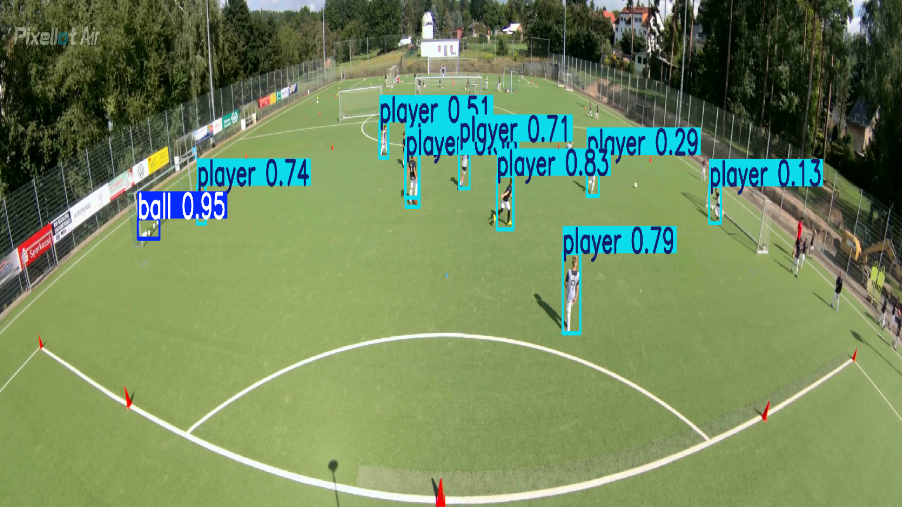

# Dự án Nhận diện Đối tượng trong Bóng đá sử dụng YOLO

Dự án này sử dụng mô hình YOLO (You Only Look Once) để phát hiện các đối tượng trong các video hoặc hình ảnh về bóng đá, chẳng hạn như cầu thủ, bóng, trọng tài, và khung thành.

## Mục lục

- [Tính năng](#tính-năng)
- [Cấu trúc Dự án](#cấu-trúc-dự-án)
- [Cài đặt](#cài-đặt)
- [Luồng làm việc](#luồng-làm-việc)
- [Cách sử dụng](#cách-sử-dụng)
- [Demo](#demo)

## Tính năng

- **Chuẩn bị dữ liệu**: Các script để chuyển đổi, phân chia và chuẩn bị dữ liệu cho việc huấn luyện mô hình YOLO.
- **Phân tích dữ liệu**: Phân tích tần suất xuất hiện của các đối tượng và mối tương quan giữa chúng.
- **Huấn luyện mô hình**: Huấn luyện mô hình YOLO tùy chỉnh trên bộ dữ liệu về bóng đá.
- **Dự đoán**: Sử dụng mô hình đã huấn luyện để phát hiện đối tượng trên video mới.
- **Trực quan hóa**: Trực quan hóa dữ liệu và kết quả dự đoán.

## Cấu trúc Dự án

```
.
├── .gitignore
├── analyze_data.py             # Script để phân tích dữ liệu (tần suất, tương quan)
├── create_yolo_format_dataset.py # Script để tạo bộ dữ liệu theo định dạng YOLO
├── datavisualvision.py         # Script để trực quan hóa dữ liệu
├── football.yaml               # File cấu hình cho dataset YOLO (đường dẫn, tên lớp)
├── predict_video.py            # Script để chạy dự đoán trên video
├── README.md                   # File tài liệu này
├── split_dataset.py            # Script để chia bộ dữ liệu thành tập train/val/test
├── requirements.txt            # Danh sách thư viện cần thiết
├── analysis_results/           # Thư mục chứa kết quả phân tích dữ liệu
│   ├── class_correlation.csv
│   └── object_frequency.csv
├── data/                       # Thư mục chứa dữ liệu gốc (hình ảnh, video, annotations)
├── football_yolo/              # Thư mục chứa bộ dữ liệu đã được xử lý theo định dạng YOLO
│   ├── images/
│   │   ├── train/
│   │   └── val/
│   └── labels/
│       ├── train/
│       └── val/
├── my_results/                 # Thư mục tùy chỉnh để lưu kết quả dự đoán
├── runs/                       # Thư mục mặc định của YOLO để lưu kết quả huấn luyện và dự đoán
│   └── detect/
├── video/                      # Thư mục chứa video và hình ảnh demo
│   ├── YOLOv8 Prediction 2025-10-23 22-22-58.mp4
│   ├── demo.gif                # (Nên chuyển video thành GIF để hiển thị trên GitHub)
│   └── image.png
└── visualization_output/       # Thư mục chứa các hình ảnh được trực quan hóa
```

## Cài đặt

### 1. Clone repository

```bash
git clone <your-repository-url>
cd football
```

### 2. Tạo môi trường ảo (khuyến nghị)

```bash
python -m venv venv
source venv/bin/activate  # Trên Windows: venv\Scripts\activate
```

### 3. Cài đặt các thư viện cần thiết

```bash
pip install -r requirements.txt
```

Nội dung file `requirements.txt`:

```txt
ultralytics>=8.0.0
pandas>=2.0.0
seaborn>=0.12.0
opencv-python>=4.8.0
matplotlib>=3.7.0
numpy>=1.24.0
```

## Luồng làm việc

1. **Chuẩn bị dữ liệu**: Thu thập hình ảnh/video và gán nhãn cho chúng. Đặt chúng vào thư mục `data/`.

2. **Tạo bộ dữ liệu YOLO**: Chạy `create_yolo_format_dataset.py` để chuyển đổi dữ liệu gốc sang định dạng YOLO và lưu vào `football_yolo/`.

3. **Phân chia dữ liệu**: Chạy `split_dataset.py` để tự động chia dữ liệu trong `football_yolo/` thành các tập `train` và `val`.

4. **Phân tích dữ liệu** (Tùy chọn): Chạy `analyze_data.py` để hiểu rõ hơn về bộ dữ liệu của bạn.

5. **Huấn luyện mô hình**: Sử dụng CLI của YOLO hoặc một script tùy chỉnh để bắt đầu quá trình huấn luyện. File `football.yaml` sẽ được dùng để chỉ định đường dẫn dữ liệu.

6. **Dự đoán**: Sử dụng `predict_video.py` và mô hình đã huấn luyện để phát hiện đối tượng trên video mới.

## Cách sử dụng

### 1. Tạo và chuẩn bị Dataset

Chạy script để tạo dataset theo định dạng YOLO:

```bash
python create_yolo_format_dataset.py
```

Chạy script để phân chia dataset:

```bash
python split_dataset.py
```

### 2. Huấn luyện mô hình

Sử dụng lệnh `yolo` từ thư viện `ultralytics`:

```bash
# Huấn luyện với mô hình YOLOv8n
yolo train data=football.yaml model=yolov8n.pt epochs=100 imgsz=640

# Hoặc với mô hình lớn hơn
yolo train data=football.yaml model=yolov8m.pt epochs=100 imgsz=640 batch=16
```

Kết quả huấn luyện sẽ được lưu trong `runs/detect/train/`.

### 3. Chạy dự đoán

```bash
python predict_video.py --source path/to/video.mp4 --weights runs/detect/train/weights/best.pt
```

Hoặc dự đoán trên ảnh:

```bash
yolo predict model=runs/detect/train/weights/best.pt source=path/to/image.jpg
```

### 4. Phân tích dữ liệu (Tùy chọn)

```bash
python analyze_data.py
```

### 5. Trực quan hóa dữ liệu (Tùy chọn)

```bash
python datavisualvision.py
```

## Demo

### Video Demo

#### Cách 1: Link trực tiếp đến video (Tải về để xem)
📹 [Xem video demo đầy đủ](video/YOLOv8%20Prediction%202025-10-23%2022-22-58.mp4)

#### Cách 2: Sử dụng GIF (Hiển thị trực tiếp - Khuyến nghị)
Để video hiển thị trực tiếp trên GitHub, hãy chuyển đổi video sang GIF:

```bash
# Cài đặt ffmpeg nếu chưa có
# Ubuntu/Debian: sudo apt-get install ffmpeg
# macOS: brew install ffmpeg
# Windows: Tải từ https://ffmpeg.org/

# Chuyển đổi video sang GIF
ffmpeg -i "video/YOLOv8 Prediction 2025-10-23 22-22-58.mp4" -vf "fps=10,scale=640:-1:flags=lanczos" -t 10 video/demo.gif
```

Sau đó thêm vào README:
```markdown

```

#### Cách 3: Upload lên GitHub Releases hoặc Issues
1. Vào tab **Issues** của repository
2. Tạo issue mới
3. Kéo thả video vào comment box
4. GitHub sẽ tự động upload và tạo link
5. Copy link đó vào README

### Hình ảnh mẫu

**Cách hiển thị ảnh trên GitHub:**

```markdown

```


**Nếu ảnh không hiển thị, kiểm tra:**

1. **Đường dẫn tương đối đúng chưa?**
   - File README.md ở root: `video/image.png` ✅
   - Nếu ở subfolder: `../video/image.png`

2. **Tên file có dấu cách hoặc ký tự đặc biệt?**
   - Đổi tên thành: `video/result-image.png`
   - Hoặc encode: `video/image%20(1).png`

3. **Commit và push ảnh lên GitHub chưa?**
   ```bash
   git add video/image.png
   git commit -m "Add demo image"
   git push
   ```

4. **Thử đường dẫn tuyệt đối (raw GitHub URL):**
<div align="center">
  
  <p><em>Mô hình</em></p>
</div>

*Hình ảnh: Mô hình YOLO phát hiện cầu thủ, bóng và các đối tượng khác trên sân bóng*

## Cấu hình football.yaml

File `football.yaml` cần có cấu trúc như sau:

```yaml
# Đường dẫn đến dataset
path: ./football_yolo
train: images/train
val: images/val

# Số lượng classes
nc: 5

# Tên các classes
names:
  0: player
  1: ball
  2: referee
  3: goalkeeper
  4: goal
```

## Các tham số huấn luyện quan trọng

- `epochs`: Số lượng epochs (mặc định: 100)
- `imgsz`: Kích thước ảnh đầu vào (mặc định: 640)
- `batch`: Batch size (mặc định: 16)
- `lr0`: Learning rate ban đầu (mặc định: 0.01)
- `patience`: Early stopping patience (mặc định: 50)

## Lưu ý

- ⚠️ **GitHub không hỗ trợ thẻ `<video>` HTML trong Markdown**. Để hiển thị video:
  - Chuyển sang GIF (khuyến nghị)
  - Upload video lên GitHub Issues/Releases và dùng link
  - Hoặc upload lên YouTube/Vimeo và nhúng link
- Đảm bảo cấu trúc thư mục đúng như mô tả trước khi chạy các script
- File `football.yaml` cần được cấu hình với đường dẫn chính xác
- Chất lượng mô hình phụ thuộc vào chất lượng và số lượng dữ liệu huấn luyện
- Nên có ít nhất 100-200 ảnh cho mỗi class để có kết quả tốt
- Sử dụng GPU để tăng tốc độ huấn luyện

## Troubleshooting

### Lỗi thiếu thư viện
```bash
pip install --upgrade ultralytics
```

### Lỗi CUDA (GPU)
```bash
# Kiểm tra CUDA
python -c "import torch; print(torch.cuda.is_available())"
```

### Lỗi đường dẫn
- Đảm bảo file `football.yaml` có đường dẫn đúng
- Kiểm tra các thư mục `train/` và `val/` tồn tại

### Video không hiển thị trên GitHub
- GitHub Markdown không hỗ trợ thẻ `<video>` HTML
- **Giải pháp**: Chuyển video sang GIF hoặc upload lên Issues để lấy link

## Tài liệu tham khảo

- [Ultralytics YOLO Documentation](https://docs.ultralytics.com/)
- [YOLOv8 GitHub](https://github.com/ultralytics/ultralytics)
- [YOLO Training Tips](https://docs.ultralytics.com/guides/model-training-tips/)

## License

MIT License

## Đóng góp

Mọi đóng góp đều được chào đón! Vui lòng:
1. Fork repository
2. Tạo branch mới (`git checkout -b feature/AmazingFeature`)
3. Commit changes (`git commit -m 'Add some AmazingFeature'`)
4. Push to branch (`git push origin feature/AmazingFeature`)
5. Mở Pull Request